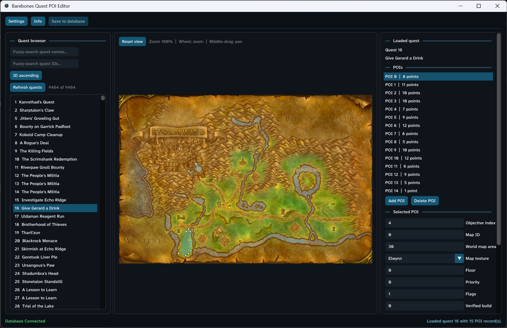

# Barebones Quest POI Editor

A focused Windows and Linux editor for the `quest_poi` and `quest_poi_points` tables used by TrinityCore 3.3.5a. It reads map data from a local WoW 3.3.5a client and deliberately does not modify any other quest data.



## Features

- Browse every quest in the connected world database.
- Fuzzy-search quests by name and ID, with ascending or descending ID order.
- Load a quest and its map automatically by selecting it in the browser.
- Reconstruct the fully revealed map by alpha-blending the client-defined subzone overlays over its fogged base tiles.
- Add, delete, and configure POIs and their ordered points.
- Left-click to add points, drag points to move them, and right-click points to remove them.
- Display a single point as a translucent blue marker and three or more points as a filled area.
- Zoom toward the mouse pointer with the wheel and pan with the middle mouse button.
- Undo with `Ctrl+Z`; redo with `Ctrl+Y` or `Ctrl+Shift+Z`.
- Warn before switching quests, disconnecting, or exiting with unsaved edits.
- Confirm the target quest, schema, POI count, and point count before every database save.
- Save both POI tables atomically. A failed statement rolls back the complete change.
- Read stock MPQs and unpacked `.MPQ` override directories with patch precedence.
- Decode the paletted, DXT1, DXT3, and DXT5 BLP variants used by 3.3.5a world maps.
- Use the same OpenGL renderer, high-DPI interface, application icon, and Atkinson Hyperlegible Next font on Windows and Linux.
- Use a 14 px default interface font, adjustable from 14 to 64 px in Settings.
- Choose a standard application-window size from 1280 x 720 through 3840 x 2160, automatically fit it to the current display's work area, center it, and restore it at startup.

## Requirements

### To run on Windows

- 64-bit Windows 10 or newer.
- A readable World of Warcraft 3.3.5a client folder.
- Network access and credentials for a TrinityCore 3.3.5a world database.
- The latest supported x64 Microsoft Visual C++ Redistributable. See [Microsoft's supported downloads page](https://learn.microsoft.com/cpp/windows/latest-supported-vc-redist).
- `StormLib.dll` and either MariaDB Connector/C (`libmariadb.dll`) or MySQL (`libmysql.dll`) beside the executable. MySQL builds may also require the accompanying OpenSSL DLLs.

### To build on Windows

- Visual Studio 2022 or newer with **Desktop development with C++**.
- Git and PowerShell.
- MariaDB Connector/C 3.4 or an installed MySQL 8 client runtime.

```powershell
.\scripts\bootstrap.ps1
.\scripts\build.ps1 -Configuration Release
```

The runnable application and runtime DLLs are written to `bin\Release`. Developer utilities and tests are written to `bin-tools\Release` so they are not mixed into the distributable application directory.

### To build and run on Linux

The Linux build targets a 64-bit X11 desktop with OpenGL 3.0 or newer and a compiler with C++23 `std::format` support (GCC 13 or newer is recommended). On Ubuntu 24.04 or a similarly current distribution, install the build and runtime prerequisites:

```bash
sudo apt install build-essential cmake git curl libgl1-mesa-dev libx11-dev \
  libxrandr-dev libxinerama-dev libxcursor-dev libxi-dev libmariadb3 zenity
bash scripts/bootstrap-linux.sh
bash scripts/build-linux.sh Release
./bin/Release/QuestPoiEditor
```

`zenity` supplies the graphical folder picker on GNOME and many other desktops. KDE users may use `kdialog` instead. If neither is installed, the client path can still be typed into Settings. The build places `libstorm.so`, the icon, and the application font beside the executable. The `.desktop` launcher template is in `packaging/barebones-quest-poi-editor.desktop` for distribution packaging.

## First run

1. Open **Settings**.
2. Choose the WoW folder that contains the `Data` directory.
3. Enter the locale folder, such as `enUS`.
4. Enter the world-database host, port, user, password, and schema name.
5. Adjust **Font size** or apply a different **Window size** under Appearance if desired.
6. Choose **Connect**. Client maps and the quest list load together.

The password is retained in memory only. The client path and non-secret connection fields are stored in `%APPDATA%\BarebonesQuestPoiEditor\settings.ini` on Windows and `$XDG_CONFIG_HOME/barebones-quest-poi-editor/settings.ini` (normally `~/.config/barebones-quest-poi-editor/settings.ini`) on Linux.

## Editing a quest

The application has three resizable panes:

- **Left:** fuzzy name/ID search and the quest browser.
- **Center:** the zoomable and pannable map canvas.
- **Right:** the loaded quest, POIs, fields, and ordered points.

Select a quest on the left to load it automatically. Select or add a POI on the right, choose its map when necessary, and edit points directly on the map.

Map controls:

- Mouse wheel: zoom toward the pointer.
- Middle-button drag: pan.
- **Reset view:** return to the fitted map.
- Left-click: add a point.
- Left-drag a point: move it.
- Right-click a point: remove it.

## Saving and database safety

Back up the world database before using any editor against production data. Prefer a database account restricted to the intended world schema and only the permissions needed to read quest data and update `quest_poi` and `quest_poi_points`.

**Save to database** displays a confirmation containing the quest ID, target schema, POI count, and point count. Saving performs this transaction:

1. Delete the selected quest's existing `quest_poi_points` rows.
2. Delete the selected quest's existing `quest_poi` rows.
3. Insert the POIs and their normalized point order currently shown in the editor.
4. Commit everything, or roll back everything if any statement fails.

Unsaved changes are marked beside the loaded quest. Selecting another quest, disconnecting, or closing the application offers **Save and continue**, **Discard changes**, and **Cancel**. Undo history is in memory only and starts fresh when another quest is loaded.

The TrinityCore server must reload quest POIs or restart before connected game clients see database changes.

## Tests

Build first, then run the core tests:

```powershell
.\bin-tools\Release\QuestPoiCoreTests.exe
```

On Linux, run `./bin-tools/Release/QuestPoiCoreTests` instead.

To include a real-client MPQ/BLP pass:

```powershell
$env:QPE_CLIENT_PATH = 'C:\Path\To\WoW-3.3.5a'
$env:QPE_CLIENT_LOCALE = 'enUS'
.\bin-tools\Release\QuestPoiCoreTests.exe
```

The database integration test is opt-in and requires a test-server account with permission to create and drop databases. It creates a uniquely named `qpe_test_*` schema, verifies a save/load round trip, forces a duplicate-key failure, verifies that rollback preserved the committed data, and then drops the test schema.

```powershell
$env:QPE_TEST_DB_HOST = '127.0.0.1'
$env:QPE_TEST_DB_PORT = '3306'
$env:QPE_TEST_DB_USER = 'integration_test_user'
$env:QPE_TEST_DB_PASSWORD = 'test-password'
.\bin-tools\Release\QuestPoiDatabaseIntegrationTests.exe
```

Do not use a production-only account for integration testing. The test never accepts an existing schema name and only drops the unique schema it creates.

## Release preparation

`bin\Release` is kept free of test executables, extraction utilities, and PDB files. Before creating a ZIP or installer, run:

```powershell
.\scripts\verify-release.ps1
```

Follow [RELEASE.md](RELEASE.md) for the expected files and final manual packaging checklist. Include this README and `THIRD_PARTY_NOTICES.md` in the distributed archive.

## Runtime notes

- MPQ access is read-only.
- BLP1 JPEG is intentionally rejected; stock 3.3.5a world-map tiles use supported paletted/DXT encodings.
- The supplied build configurations are x64-only, matching the packaged connector and StormLib builds.
- Runtime database and archive libraries are loaded dynamically, so the application project does not require their headers or import libraries.
